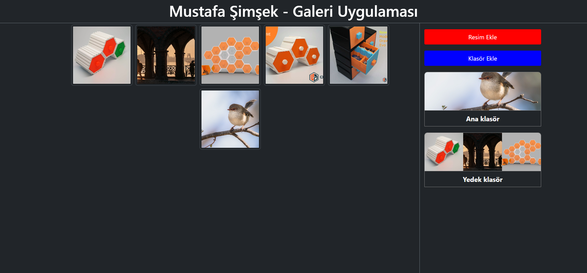

### PHP ve JQUERY kullanarak oluşuturulmuş fotoğraf galeri web uygulaması

javascript ile seçilen dosyları ajax methodunun php tarafına dosyaları gönderip yüklemesini, klasör oluşturmayı ve klasor & dosya listelemesini sağlar.

